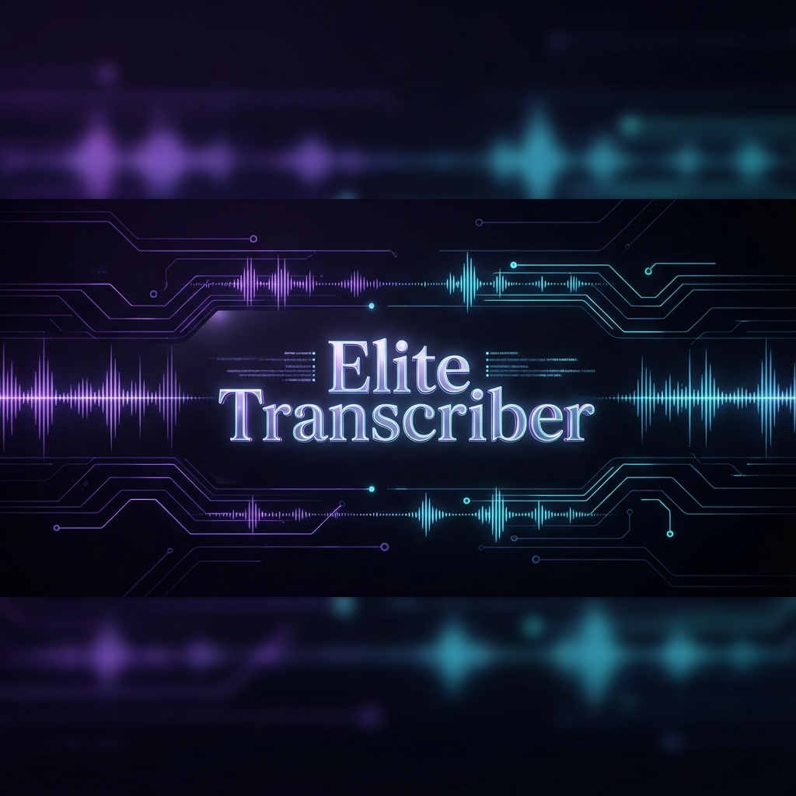

# 🎙️ Elite Transcriber CLI V2



An "Elite" level command-line interface for high-performance audio and video transcription. Optimized for English, Urdu, and Hindi, powered by `faster-whisper`.

## ✨ Features

- **🚀 Industry-Leading Performance**: Powered by `faster-whisper`, up to 600x realtime on CPU.
- **🌍 Multi-Language Mastery**: Seamlessly detects and transcribes English, Urdu, Hindi, and 90+ other languages.
- **💎 Premium UX**: Beautiful terminal interface with real-time progress tracking via `rich`.
- **🎤 Live Listen Mode**: Transcribe directly from your microphone in real-time!
- **💾 Explicit Export**: Only save `.txt` or `.srt` when you ask for it—no more wasted storage.
- **📂 Batch Processing**: Transcribe entire directories with a single command.
- **🌎 Global Command**: Run `transcriber` from any PowerShell or CMD window.

## 🚀 Installation

### Prerequisites
- Python 3.10+
- FFmpeg installed and added to PATH

### Setup
1. Clone the repository:
   ```bash
   git clone https://github.com/PytorMuhammad/transcriber.git
   cd transcriber
   ```
2. Install dependencies:
   ```bash
   pip install -r requirements.txt
   ```
3. Add to PATH (Windows):
   - Add the project directory to your User PATH environment variable.
   - Use the included `transcriber.bat` for global access.

## 📖 Usage

### Single File (No Save)
```powershell
transcriber /f "path/to/media.mp3"
```

### Single File → Save .txt
```powershell
transcriber /f "path/to/media.mp3" --txt
```

### Single File → Save .srt (Subtitles)
```powershell
transcriber /f "path/to/media.mp3" --srt
```

### Entire Directory with Both Exports
```powershell
transcriber /d "path/to/folder" --txt --srt
```

### 🎤 Live Listen Mode (NEW!)
Start transcribing from your microphone. Say **"Done Over"** to stop.
```powershell
transcriber --listen --lang ur
```
You can also change the stop phrase:
```powershell
transcriber --listen --stop-word "stop now"
```

## 🛠️ Configuration

| Flag | Description | Default |
| --- | --- | --- |
| `/f`, `--file` | Path to a single file | None |
| `/d`, `--dir` | Path to a directory | None |
| `--listen` | Start live microphone transcription | Off |
| `--model` | Model size (tiny, base, small, medium, large-v3) | `base` |
| `--lang` | Force language (e.g., `ur`, `hi`, `en`) | Auto |
| `--prompt` | Technical context for the AI | None |
| `--txt` | Save transcript to `.txt` file | Off |
| `--srt` | Save transcript to `.srt` file | Off |
| `--stop-word` | Phrase to stop listen mode | `done over` |

## 🤝 Contribution
Built with ❤️ for elite level developers. Feel free to fork and enhance!
